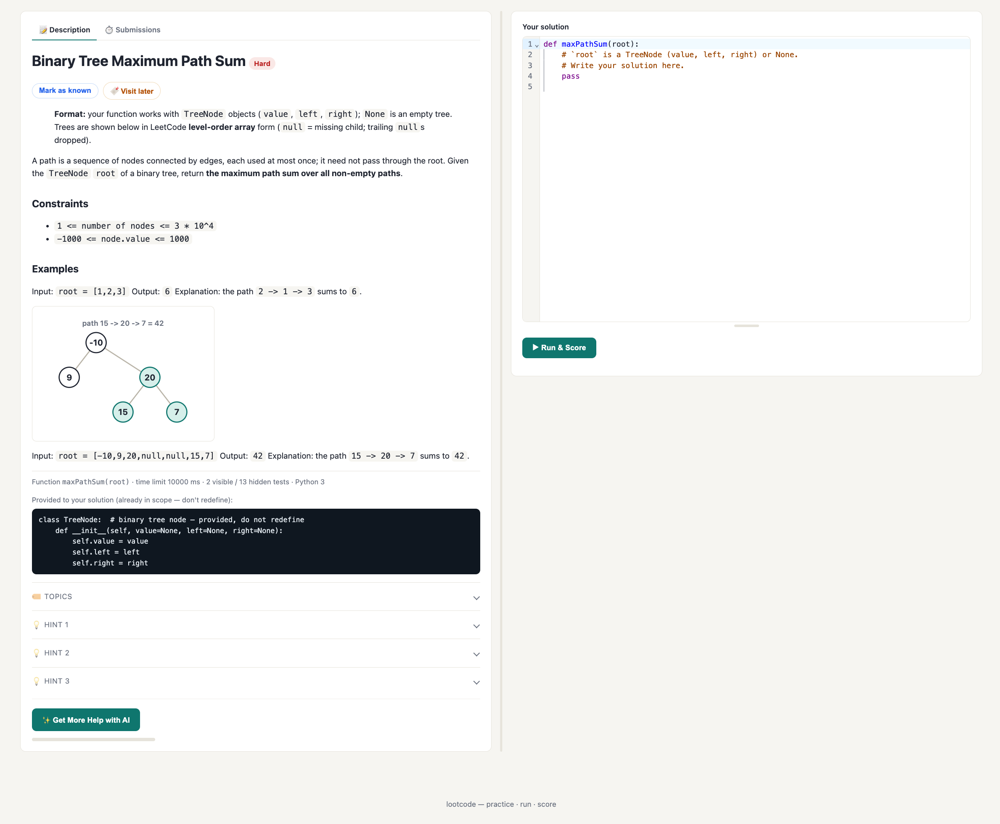
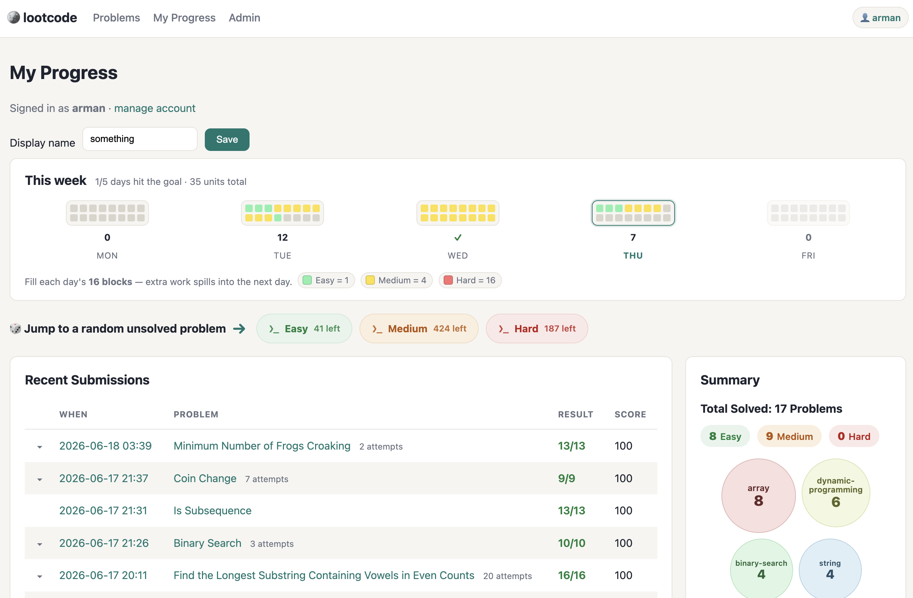
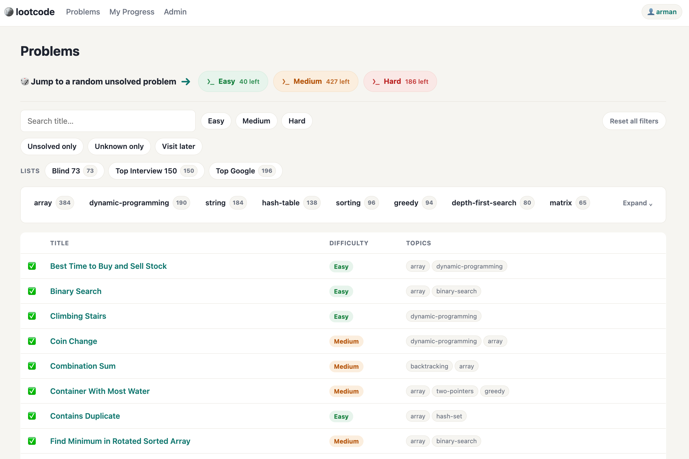

<div align="center">

# 🪙 lootcode

**Practice coding exercises, write a solution, run it against tests, get scored.**

A lightweight, self-hostable LeetCode-style platform. Python 3 · FastAPI · SQLite · 741 problems.



</div>

---

## Features

- **Browse & filter** ~741 problems by difficulty, topic (38-tag taxonomy), title search, and **curated collections** (system-defined study lists like *Blind 73* and *Top Interview 150*).
- **Solve in-browser** in a CodeMirror Python editor with per-problem starter code and optional **progressive hints** (up to 3, collapsed by default).
- **Real data-structure types** — tree and linked-list problems hand your solver actual objects, not arrays: `TreeNode`, singly-linked `ListNode`, and doubly-linked `Node` are built at the sandbox boundary and injected for you (LeetCode conventions), so you write pointer code instead of re-parsing arrays.
- **Run & score** against all tests (visible examples + hidden), weighted per test, with per-visible-test feedback. Multiple answer-ordering judges (`exact` / `unordered` / `set_of_lists`). Hidden cases can be machine-strengthened to catch buggy solutions.
- **Sandboxed execution** — user code runs with per-test time limits, a memory cap, a process cap (anti fork-bomb), an output cap, and a throwaway working dir. Two backends: `subprocess` (default, zero-dependency) and `docker` (network-disabled, stronger isolation).
- **No-password profiles** — a cookie gives each visitor their own identity; track solved problems and submission history. Optional username/password accounts let progress follow you across devices.
- **Admin tools** — add a problem by hand, or **generate one with the Claude API** (every AI problem is verified by running its reference solution against its own tests before it's saved).

> Built to be lightweight and run on a home/LAN server. See `docs/roadmap.md` for status and what's next.



## Quick start

```bash
git clone <this-repo> && cd lootcode
python3 -m venv .venv && . .venv/bin/activate
pip install -r requirements.txt
uvicorn app.main:app --reload
```

Open **http://127.0.0.1:8000**. On first run the SQLite database is created and
auto-seeded from `content/problems/` (no extra steps). *Verified clean-room: fresh
venv → install → boot serves the homepage and seeds all 741 problems.*

**Reach it from other devices on your LAN:**

```bash
HOST=0.0.0.0 uvicorn app.main:app --port 8000   # visit http://<server-ip>:8000
```

**Optional — AI problem generation:**

```bash
cp .env.example .env        # then set ANTHROPIC_API_KEY
```

**Docker:** `docker compose up` (see `docker-compose.yml`). **Make shortcuts:** `make install`, `make dev`, `make run`, `make test`.



## Development

```bash
pip install -r requirements-dev.txt
python -m pytest -q          # tests, incl. adversarial executor (TLE / fork-bomb / error)
python scripts/seed.py       # (re)load content into the DB and verify canonical solutions
python scripts/audit.py      # check statement ↔ test ↔ judge consistency
python scripts/verify_bank.py -j 8               # run every canonical against its own tests (all roots)
python scripts/check_constraint_validators.py    # check every stored test input satisfies its validate_input()
python scripts/verify_json.py <folder>           # batch-verify loose problem JSON (e.g. generator output) before importing
```

`verify_bank.py`, `audit.py`, and `check_constraint_validators.py` cover the whole
on-disk bank — both the committed `content/problems/` and the optional local
`content/problems-extended/` set — so `--content-dir <dir>` scopes any of them to a
single root.

## What's in this repo

**The application** — everything needed to run lootcode:

| Path | What it is |
|------|------------|
| `app/` | The FastAPI app: HTML UI (`routers/pages.py`, `templates/`, `static/`), JSON run API (`routers/submissions.py`), admin (`routers/admin.py`), sandboxed `executor/` (`harness.py` runs inside the sandbox, with rich-type codecs for `TreeNode`/`ListNode`), test-strengthening library (`testgen/`), Claude-API generator (`llm/`), and ORM/data layer (`models.py`, `db.py`, `store.py`, `content.py`, `tags.py`, `auth.py`, `config.py`). |
| `content/problems/` | The 741 problem definitions (Markdown statement + tests + starter + canonical solution; optional `assets/` figures and an `input_validator/` legal-input predicate). Durable, human-editable mirror of the DB. |
| `content/problems-extended/`, `content/collections/` | Optional **extended** problem set kept local (gitignored, seeded alongside the default set when present — see `docs/extended-problems.md`), and curated **collections** (`blind-73.json`, `top-interview-150.json`, …) used as a list filter. |
| `scripts/seed.py`, `audit.py`, `verify_bank.py`, `check_constraint_validators.py`, `strengthen_tests.py`, `import_generated_problems.py`, `verify_json.py`, `figures.py` | Operational scripts: seed/verify the DB, statement↔test↔judge consistency audit, run every canonical against its tests, audit per-problem input validators, machine-generate discriminating hidden tests, bulk-import a staging folder of fully-generated problems, batch-verify loose problem JSON before importing, and SVG figure helpers. |
| `tests/` | pytest suite. |
| `docs/`, `specs/` | Engineering docs and the problem-schema / authoring / tags specs. |
| `Dockerfile`, `docker-compose.yml`, `infra/`, `Makefile`, `requirements*.txt`, `.env.example` | Build / run / deploy config. |
| `CLAUDE.md`, `CONTRIBUTING.md`, `.claude/` | Project guidance and Claude Code config (skills, subagents). |

**Problem-loading tooling** — used to *bulk-build the bank*, not needed to run the app:

| Path | What it is |
|------|------------|
| `scripts/build_bank.py`, `scripts/bank_new_p/` | Bulk-author pipeline. Each problem ships a canonical solution; every test's expected output is *computed* by running that canonical and cross-checked against a brute-force reference, so a buggy problem can't enter the bank. Output is written into `content/problems/`. |


## License

[MIT](LICENSE).

---

*lootcode was developed fully by [Claude](https://claude.com/claude-code) (Anthropic) — application code, the 741-problem bank, and these docs.*
